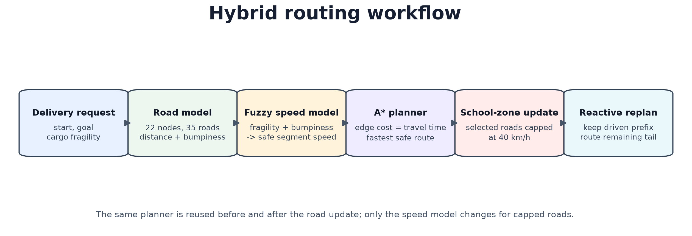
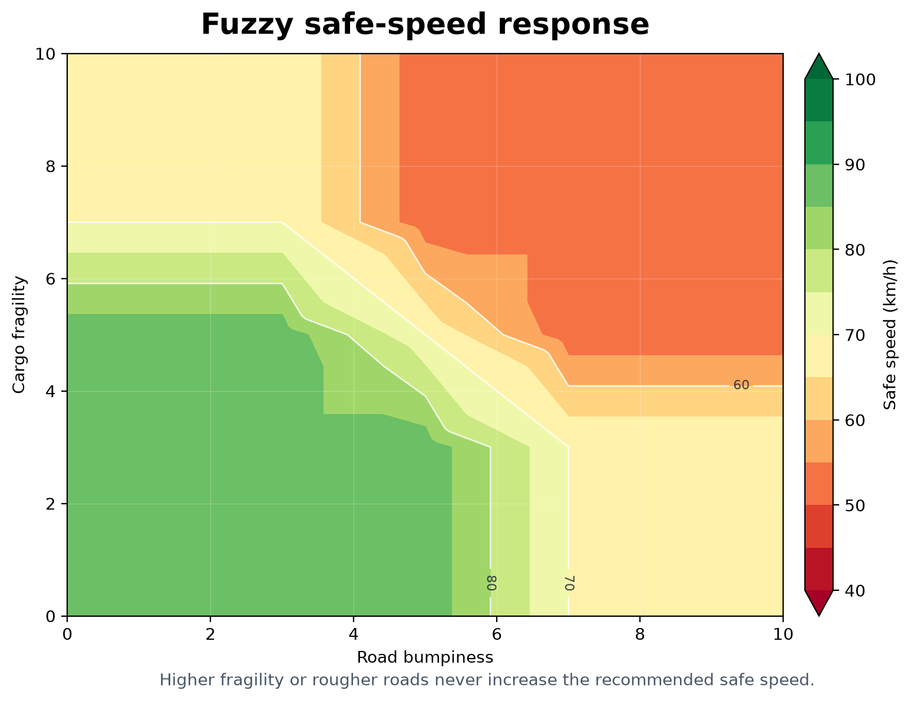
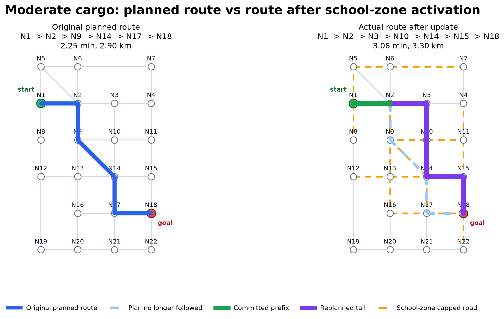

# Hybrid Delivery Router

A compact Python route-planning project that combines A* search, a fuzzy safe-speed controller, and reactive replanning on a changing delivery network.

## Problem

A delivery route is not always just the shortest path. In this simulation, each road segment has a distance and a bumpiness score, while the vehicle carries cargo with a fragility level. The planner needs to choose the fastest route that still respects cargo safety, then adapt if a school-zone speed cap appears after the vehicle has already started driving.

## System Behaviour

The system models a 22-intersection, 35-road network. For a requested start and goal, it:

- converts cargo fragility and road bumpiness into a safe speed for each segment;
- runs A* on travel time, not raw distance;
- activates deterministic school-zone caps mid-journey;
- preserves the already-driven prefix at its original speeds;
- replans only the remaining tail under the new capped-road speed model.

## Architecture



The package keeps the notebook out of the critical path: map data, fuzzy inference, A* planning, reactive replanning, and evaluation helpers live under `src/hybrid_delivery_router/` and are exercised by tests.

## Fuzzy Controller

The fuzzy controller is implemented from scratch with NumPy. It uses cargo fragility and road bumpiness memberships to activate nine rules, then returns a crisp safe speed between 40 and 100 km/h.



Validated consequent centroids are `Slow = 51.6`, `Medium = 70.0`, and `Fast = 88.4` km/h. The tested response surface has zero monotonicity violations, so increasing fragility or bumpiness never increases the recommended speed.

## Results

Default delivery target: `N1 -> N18`.

| Scenario | Route | Time | Distance | A* nodes | Rerouted |
|---|---|---:|---:|---:|:---:|
| Baseline constant speed | `N1 -> N2 -> N9 -> N14 -> N17 -> N18` | 1.74 min | 2.90 km | 16 | No |
| Fuzzy A*, robust cargo | `N1 -> N2 -> N9 -> N14 -> N15 -> N18` | 2.03 min | 2.90 km | 15 | No |
| Fuzzy A*, moderate cargo | `N1 -> N2 -> N9 -> N14 -> N17 -> N18` | 2.25 min | 2.90 km | 17 | No |
| Fuzzy A*, delicate cargo | `N1 -> N2 -> N9 -> N14 -> N17 -> N18` | 2.79 min | 2.90 km | 17 | No |
| Reactive replanning, robust cargo | `N1 -> N2 -> N3 -> N10 -> N14 -> N15 -> N18` | 2.88 min | 3.30 km | 31 | Yes |
| Reactive replanning, moderate cargo | `N1 -> N2 -> N3 -> N10 -> N14 -> N15 -> N18` | 3.06 min | 3.30 km | 34 | Yes |
| Reactive replanning, delicate cargo | `N1 -> N2 -> N9 -> N14 -> N15 -> N18` | 3.50 min | 2.90 km | 34 | Yes |

For a moderate-fragility delivery, the initial fuzzy A* route is partly abandoned after school-zone activation. The first segment remains committed; the remaining route is replanned from `N2`.



The full six-panel route comparison is kept in [docs/six_panel_route_comparison.png](docs/six_panel_route_comparison.png) so the main README stays readable.

## Validation

The automated tests check the claims that matter for a portfolio review:

- graph integrity: 22 nodes, 35 undirected road segments, connected network, and the intentionally absent `N8 <-> N9` edge;
- A* optimality against uniform-cost search for the constant-speed baseline and fuzzy speed model;
- heuristic admissibility, with `0 / 21` violations for the project heuristic and `13 / 21` for a deliberately bad school-zone heuristic;
- fuzzy-controller bounds and monotonicity;
- school-zone caps applying only after activation;
- reactive replanning with phase-aware route-cost calculation;
- clean handling of start-equals-goal and unreachable-route cases.

CI runs the same unittest suite through GitHub Actions.

## Usage

Use CPython from python.org, the Windows `py` launcher, or Anaconda. Avoid MSYS2 Python unless you already have scientific wheels configured, because NumPy may otherwise build from source.

Windows PowerShell:

```powershell
py -3.12 -m venv .venv
.\.venv\Scripts\python.exe -m pip install -r requirements.txt
.\.venv\Scripts\python.exe -m pip install -e .
.\.venv\Scripts\python.exe examples/run_demo.py
.\.venv\Scripts\python.exe -m unittest discover -s tests
.\.venv\Scripts\python.exe -m jupyter nbconvert --to notebook --execute notebooks/hybrid_delivery_router.ipynb --output executed.ipynb --output-dir .audit_outputs
```

macOS/Linux:

```bash
python3 -m venv .venv
./.venv/bin/python -m pip install -r requirements.txt
./.venv/bin/python -m pip install -e .
./.venv/bin/python examples/run_demo.py
./.venv/bin/python -m unittest discover -s tests
./.venv/bin/python -m jupyter nbconvert --to notebook --execute notebooks/hybrid_delivery_router.ipynb --output executed.ipynb --output-dir .audit_outputs
```

Minimal API example:

```python
from hybrid_delivery_router import (
    BoxHillDeliveryMap,
    FuzzySpeedController,
    HybridPlanner,
    cargo_top_speed,
    fuzzy_informed_heuristic,
    fuzzy_speed,
)

env = BoxHillDeliveryMap()
controller = FuzzySpeedController()
planner = HybridPlanner(env)

fragility = 8.0
heuristic = fuzzy_informed_heuristic(env, cargo_top_speed(controller, fragility))
result = planner.astar("N1", "N18", fuzzy_speed(env, controller, fragility), h_fn=heuristic)

print(result.path)
print(round(result.time_min, 2))
```

## Limitations

This is a deterministic simulation, not a live navigation system. It uses a compact synthetic road graph, synthetic bumpiness scores, and deterministic school-zone activation. It optimizes travel time only; production routing would need live traffic, turn costs, delivery windows, emissions, legal road rules, and richer risk modelling.

## Repository Layout

```text
.
|-- .github/workflows/tests.yml
|-- assets/
|   |-- fuzzy_safe_speed_surface.png
|   |-- hybrid_routing_workflow.png
|   `-- moderate_replanning_routes.png
|-- docs/
|   |-- six_panel_route_comparison.png
|   `-- technical_notes.md
|-- examples/run_demo.py
|-- notebooks/hybrid_delivery_router.ipynb
|-- src/hybrid_delivery_router/
|   |-- agent.py
|   |-- evaluation.py
|   |-- fuzzy.py
|   |-- map_model.py
|   `-- planner.py
|-- tests/test_hybrid_delivery_router.py
|-- pyproject.toml
|-- requirements.txt
`-- README.md
```

## Further Reading

See [docs/technical_notes.md](docs/technical_notes.md) for modelling assumptions, heuristic reasoning, and implementation notes. The public notebook, [notebooks/hybrid_delivery_router.ipynb](notebooks/hybrid_delivery_router.ipynb), provides a step-by-step walkthrough using the package code.
