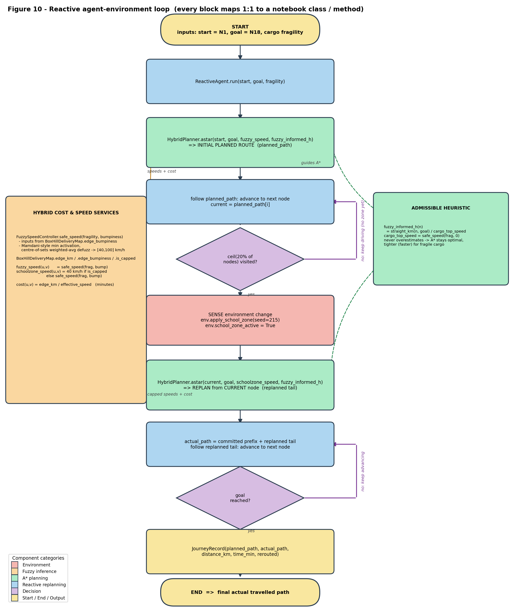

# Hybrid Delivery Router

A Python route-planning project that combines **A\*** search, a hand-built
**fuzzy logic speed controller**, and **reactive replanning** for a delivery
network with changing road constraints.

The system plans the fastest safe route for a cargo vehicle. Road segments have
both distance and bumpiness. Cargo has a fragility level. The fuzzy controller
turns fragility and bumpiness into a safe speed for each road segment, then A*
uses those speeds as edge costs. When a school-zone speed cap appears mid-route,
the agent replans from its current location instead of blindly following the old
path.



## Why This Project Matters

This is more than a shortest-path notebook. It demonstrates how to combine
multiple AI techniques into one testable decision system:

- **A\* search** for optimal path planning on a weighted graph.
- **Uniform-cost search** as the uninformed optimality baseline.
- **Custom admissible heuristics** based on straight-line distance and maximum
  achievable speed.
- **Fuzzy inference from scratch** using NumPy, not a fuzzy-logic package.
- **Reactive replanning** when road constraints change during the journey.
- **Safety checks** for heuristic admissibility, fuzzy monotonicity,
  unreachable-route handling, and phase-aware travel-time consistency.

## Project Structure

```text
.
|-- .github/workflows/tests.yml
|-- assets/reactive_agent_flowchart.png
|-- docs/technical_notes.md
|-- examples/run_demo.py
|-- notebooks/hybrid_delivery_router.ipynb
|-- src/hybrid_delivery_router/
|   |-- agent.py
|   |-- evaluation.py
|   |-- fuzzy.py
|   |-- map_model.py
|   `-- planner.py
|-- tests/test_hybrid_delivery_router.py
|-- pyproject.toml
|-- requirements.txt
`-- README.md
```

## Core Results

Default delivery target: `N1 -> N18`.

| Scenario | Route | Time | A* nodes | Rerouted |
|---|---|---:|---:|:---:|
| Baseline constant speed | `N1 -> N2 -> N9 -> N14 -> N17 -> N18` | 1.74 min | 16 | No |
| Fuzzy A*, robust cargo | `N1 -> N2 -> N9 -> N14 -> N15 -> N18` | 2.03 min | 15 | No |
| Fuzzy A*, moderate cargo | `N1 -> N2 -> N9 -> N14 -> N17 -> N18` | 2.25 min | 17 | No |
| Fuzzy A*, delicate cargo | `N1 -> N2 -> N9 -> N14 -> N17 -> N18` | 2.79 min | 17 | No |
| Reactive replanning, robust cargo | `N1 -> N2 -> N3 -> N10 -> N14 -> N15 -> N18` | 2.88 min | 31 | Yes |
| Reactive replanning, moderate cargo | `N1 -> N2 -> N3 -> N10 -> N14 -> N15 -> N18` | 3.06 min | 34 | Yes |
| Reactive replanning, delicate cargo | `N1 -> N2 -> N9 -> N14 -> N15 -> N18` | 3.50 min | 34 | Yes |

## Verification Highlights

The automated tests cover the engineering claims behind the model:

- The graph has 22 nodes, 35 undirected road segments, and remains connected.
- The inherited missing `N8 <-> N9` link is represented as an absent edge.
- Baseline A* returns the same optimal cost as uniform-cost search.
- Fuzzy A* returns the same optimal cost as uniform-cost search for all main cargo levels.
- The good heuristic has `0 / 21` admissibility violations.
- A deliberately bad `straight_line / 40 km/h` heuristic has `13 / 21`
  violations, showing why heuristic design matters.
- The fuzzy controller has zero monotonicity violations: it never increases safe
  speed when cargo becomes more fragile or the road becomes rougher.
- Reactive replanning keeps the already-driven prefix at pre-zone speeds and
  applies the 40 km/h cap only to the replanned tail.
- Unreachable routes return `None` / infinity at planner level and raise a clear
  error at reactive-agent level.

## Quick Start

Use CPython from python.org, the Windows `py` launcher, or Anaconda. Avoid MSYS2
Python for this project unless you already have scientific wheels configured,
because NumPy may otherwise build from source.

Windows PowerShell:

```powershell
py -3.12 -m venv .venv
.\.venv\Scripts\python.exe -m pip install -r requirements.txt
.\.venv\Scripts\python.exe -m pip install -e .
.\.venv\Scripts\python.exe examples
un_demo.py
.\.venv\Scripts\python.exe -m unittest discover -s tests
.\.venv\Scripts\python.exe -m jupyter nbconvert --to notebook --execute notebooks\hybrid_delivery_router.ipynb --output executed.ipynb --output-dir .audit_outputs
```

macOS/Linux:

```bash
python3 -m venv .venv
./.venv/bin/python -m pip install -r requirements.txt
./.venv/bin/python -m pip install -e .
./.venv/bin/python examples/run_demo.py
./.venv/bin/python -m unittest discover -s tests
./.venv/bin/python -m jupyter nbconvert --to notebook --execute notebooks/hybrid_delivery_router.ipynb --output executed.ipynb --output-dir .audit_outputs
```

## Example Usage

```python
from hybrid_delivery_router import (
    BoxHillDeliveryMap,
    FuzzySpeedController,
    HybridPlanner,
    cargo_top_speed,
    fuzzy_informed_heuristic,
    fuzzy_speed,
)

env = BoxHillDeliveryMap()
controller = FuzzySpeedController()
planner = HybridPlanner(env)

fragility = 8.0
heuristic = fuzzy_informed_heuristic(env, cargo_top_speed(controller, fragility))
result = planner.astar("N1", "N18", fuzzy_speed(env, controller, fragility), h_fn=heuristic)

print(result.path)
print(round(result.time_min, 2))
```

## Design Notes

The package is intentionally small and inspectable. The notebook is now only a
presentation layer; the core logic lives in `src/` and is covered by tests. See
[docs/technical_notes.md](docs/technical_notes.md) for the modelling assumptions,
heuristic reasoning, and current limitations.
